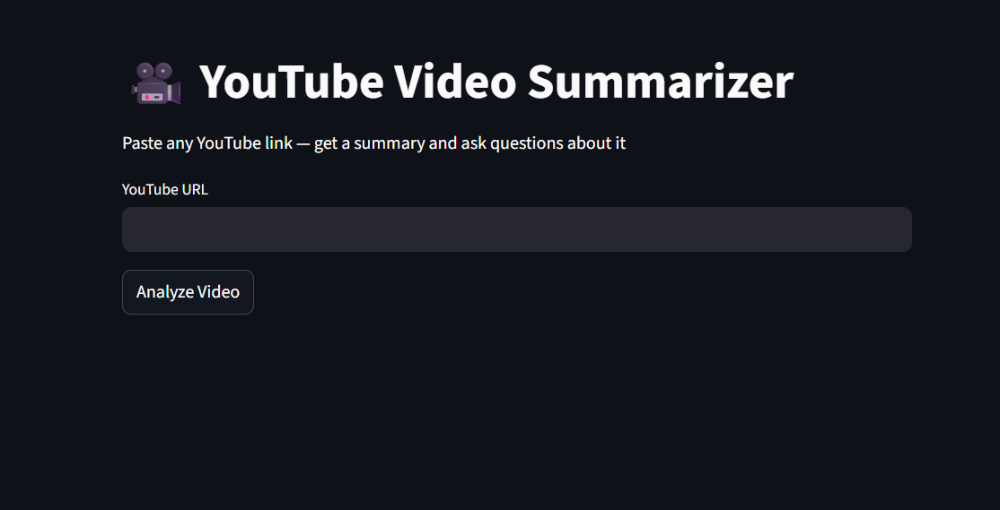
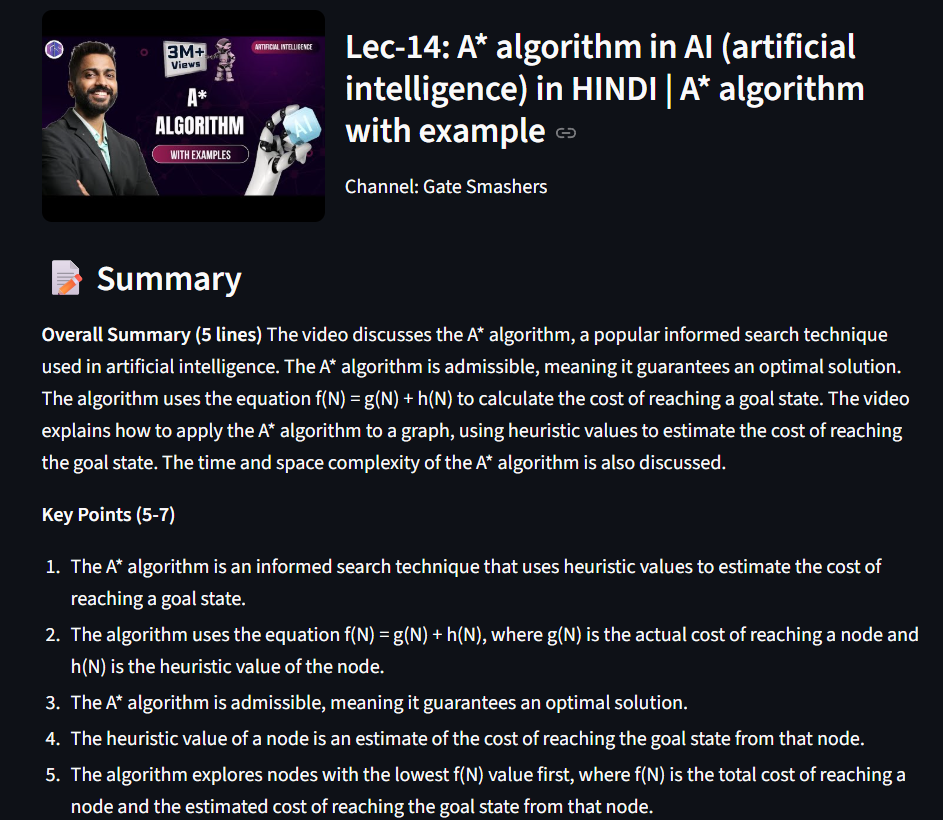
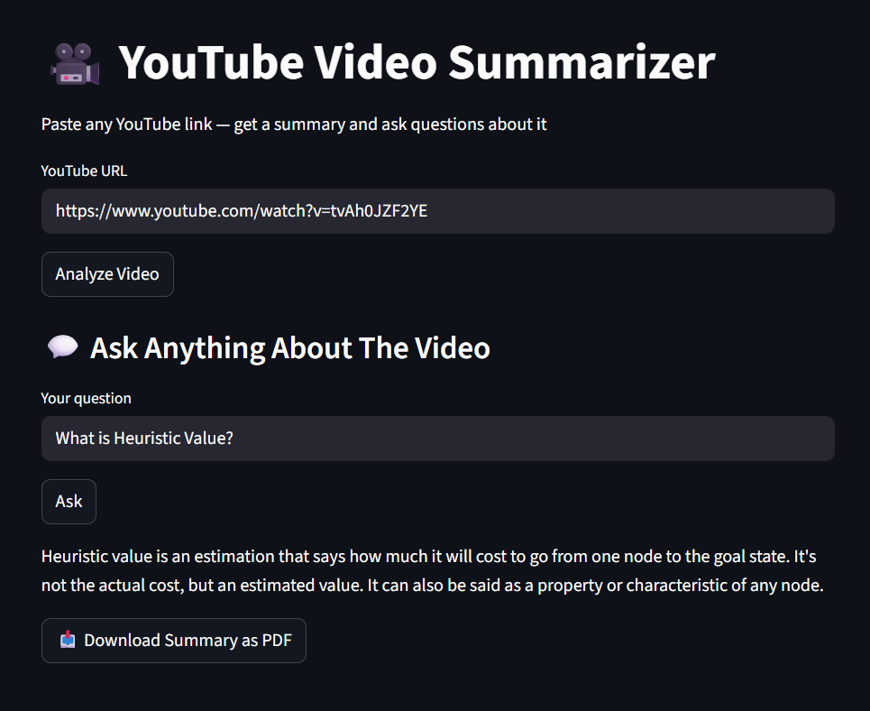

# 🎥 AI-Powered YouTube Video Summarizer & Q&A

An AI-powered app that takes any YouTube video link, generates structured notes and summaries, and lets you ask follow-up questions — all powered by a RAG pipeline with semantic search.



## Demo
▶️ [Watch Demo Video](https://youtu.be/dmjaIftewdM)

---

## Features
- 🎬 Paste any YouTube URL — supports English and Hindi videos
- 📝 Get an instant AI-generated summary with key points
- 💬 Ask follow-up questions about the video content
- 📄 Download the summary as a PDF
- 🖼️ Displays video thumbnail, title, and channel info

---

## How It Works  
YouTube URL  
↓  
Fetch Transcript (youtube-transcript-api)  
↓  
Chunk Text (LangChain Text Splitter)  
↓  
Vectorize Chunks (Sentence Transformers)  
↓  
Store Vectors (Numpy)  
↓  
Generate Summary (Groq - LLaMA 3.3 70B)  
↓  
Q&A via Semantic Search + Groq  
---

## Screenshots

| Video Info + Summary | Q&A Section |
|---|---|
|  |  |

---

## Tech Stack

| Tool | Purpose |
|---|---|
| Streamlit | Frontend UI |
| Groq (LLaMA 3.3 70B) | LLM for summary and Q&A |
| LangChain | Text chunking |
| Sentence Transformers | Text vectorization |
| Numpy | Semantic similarity search |
| youtube-transcript-api | Fetch video transcripts |
| BeautifulSoup | Fetch video metadata |
| ReportLab | PDF generation |

---

## Run Locally

1. Clone the repo
```bash
git clone https://github.com/ishitanotfound/NoteLLM.git
cd NoteLLM
```

2. Install dependencies
```bash
pip install -r requirements.txt
```

3. Create a `.env` file
GROQ_API_KEY=your_groq_api_key
4. Run the app
```bash
streamlit run app.py
```

---

## Project Structure
video-summarizer/  
├── app.py  
├── requirements.txt  
├── .env  
├── .gitignore  
├── assets/  
│   ├── screenshot1.png  
│   └── screenshot2.png  
|   └── screenshot3.png  
└── README.md  


## Future Improvements
- Support for videos without captions using Whisper (speech-to-text)
- Visual frame analysis using Gemini's multimodal capabilities
- Playlist summarization support
- Deploy with proxy support for cloud hosting